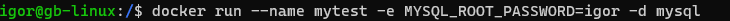
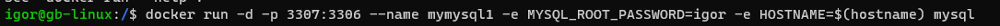
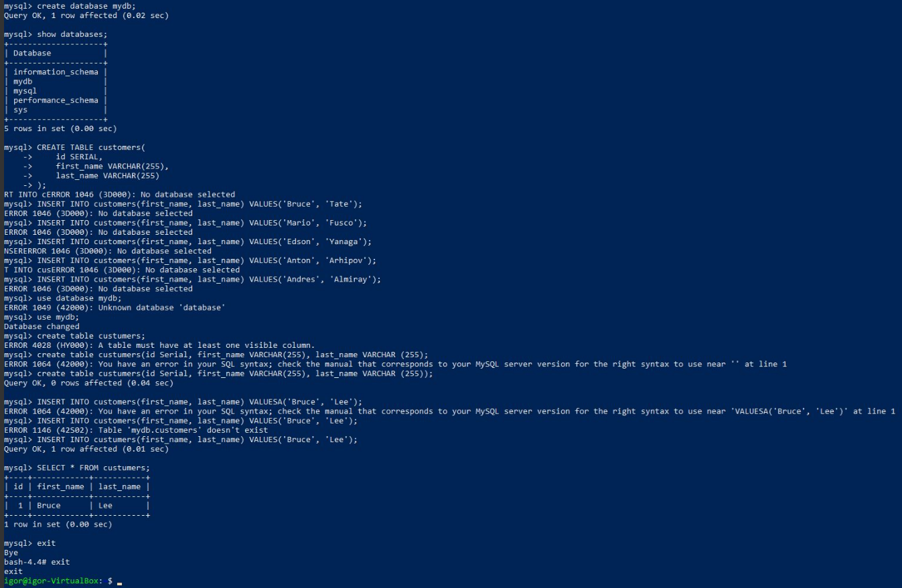
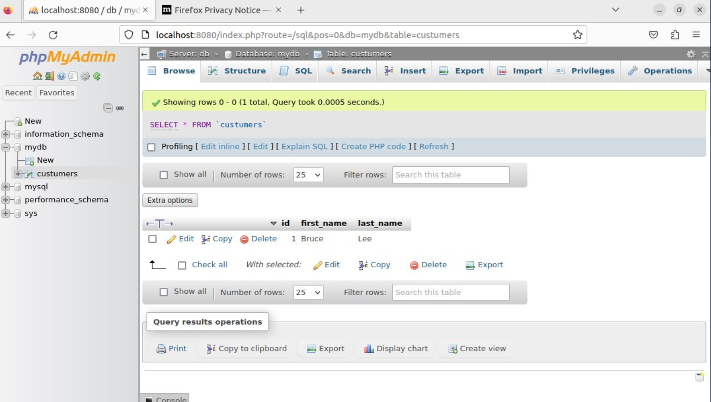

'## Задание:
1) запустить контейнер с БД, отличной от mariaDB, используя инструкции на сайте: https://hub.docker.com/

    

2) добавить в контейнер hostname такой же, как hostname системы через переменную

    

3) заполнить БД данными через консоль

    

4) запустить phpmyadmin (в контейнере) и через веб проверить, что все введенные данные доступны

    